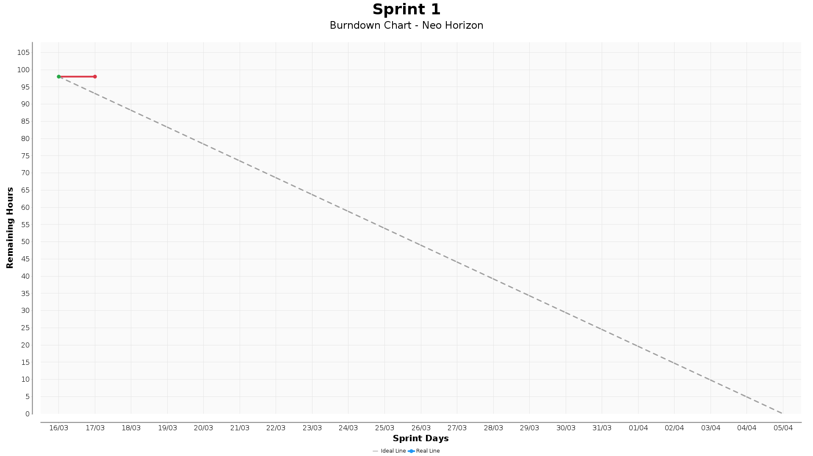

# 
API 6º Semestre - BD 2026

   •
   •
   •
   •
   •
   •
   •
   •
   •
  

## :bulb: Contexto e Desafio 

## :dart: Objetivo do Projeto

## Requisitos Funcionais e Não Funcionais

Mostrar Requisitos Funcionais e Não Funcionais

### Requisitos Funcionais

| ID | Requisito | Descrição |
|:---|:---|:---|

### Requisitos Não Funcionais

| ID | Requisito | Descrição |
|:---|:---|:---|

## :date: Backlog do Produto 

Mostrar Backlog do Produto

 

| ID | Rank | Prioridade | User Story | Sprint | Requisitos Relacionados |
|:---|:---|:---|:---|:---|:---|

## :date: Sprint Backlog 

Mostrar Spring Backlog

### Sprint 1

| ID | Rank | Prioridade na Sprint | User Story | Requisitos Relacionados |
|:---|:---|:---|:---|:---|

### Sprint 2

| ID | Rank | Prioridade na Sprint | User Story | Requisitos Relacionados |
|:---|:---|:---|:---|:---|

### Sprint 3

| ID | Rank | Prioridade na Sprint | User Story | Requisitos Relacionados |
|:---|:---|:---|:---|:---|

 

## :calendar: <a id="cronograma"> Cronograma 📅 </a>

| Sprint  | Nome | Data inicio  | Data Fim | Status |
| --- | -------------------------- | --------| ----- | --- |
| --- | KickOff                    | 02/03   | 06/03 |     |
| --- | Planejamento               | 09/03   | 13/13 |     |
|  1  | Sprint 1                   | 16/03   | 05/04 |     |
|  2  | Sprint review / Planning   | 06/04   | 10/04 |     |
|  3  | Sprint 2                   | 13/04   | 03/05 |     |
|  4  | Sprint review / Planning   | 04/05   | 08/05 |     |
|  5  | Sprint 3                   | 11/05   | 31/05 |     |
|  6  | Sprint review              | 01/06   | 05/06 |     |
|  7  | Feira de Soluções          | 11/06   |       |     |
|  8  | Apresentações TGs          | 15/06   | 19/06 |     |

 

## :mortar_board: Integrantes da Equipe:

| *Nome*                   | *Função*            | *LinkedIn*                                                  |
|:------------------:|:-----------------:|:---------------------------------------:|
| Vinicius Monteiro | Product Owner     |  |
| Cesar Pelogia | Scrum Master  |  |
| Alexandre Jonas | Developer     |  |
| Lucas Henrique | Developer     |  |
| Gabriel Souza | Developer     |  |
| Gustavo Robert     | Developer     |  |
| Vitor Morais       | Developer     |  |

 

## Padrões de Processo 
[Wiki]()

 

## Gráfico Burndown

 

## Tecnologias Utilizadas

## Burndown Automatico

Guia completo de uso, execução local e CI:

- `burndown/README.md`
