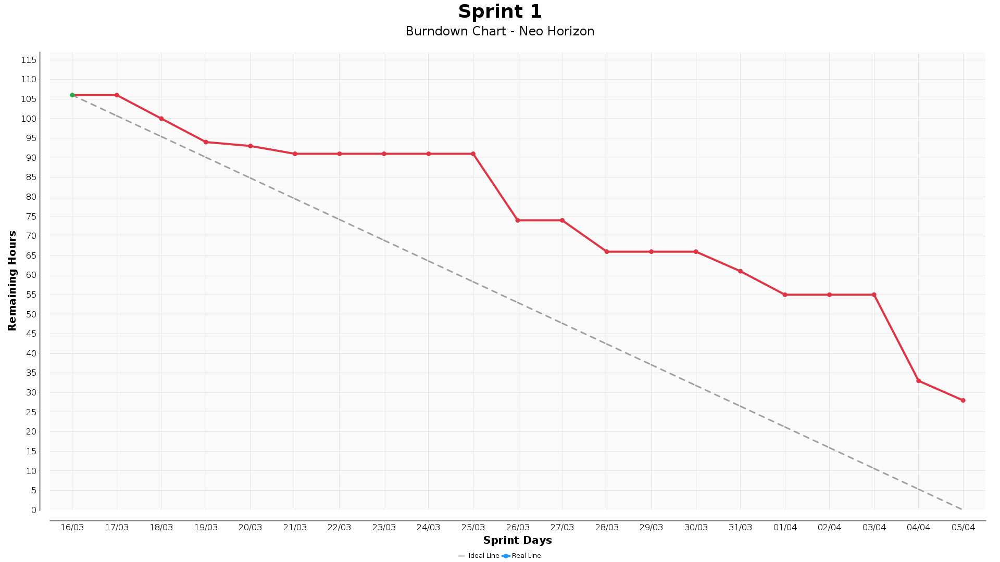

# 
API 6th Semester - BD 2026

  

  <a href="#problem">💡 Context and Challenge</a> •
  <a href="#objective">🎯 Project Objective</a> •
  <a href="#requirements">📋 Requirements</a> •
  <a href="#product-backlog">📦 Product Backlog</a> •
  <a href="#sprint-backlog">🗓️ Sprint Backlog</a> •
  <a href="#schedule">📅 Schedule</a> •
  <a href="#team-members">👥 Team Members</a> •
  <a href="#technologies">🛠️ Technologies</a> •
  <a href="#process-standards">📁 Process Standards</a> •
  <a href="#technical-documentation">📖 Technical Documentation</a> •
  <a href="#burndown">📈 Burndown</a>

---

## 💡 Context and Challenge 

[Tecsys do Brasil](https://www.tecsysbrasil.com.br/), a partner company operating in the electrical grid monitoring sector, has products capable of identifying faults and vulnerabilities in the energy distribution infrastructure. However, despite mastering field monitoring technology, the company lacks a structured way to process and analyze the public data made available by ANEEL. Without this treatment, accurately identifying which regions of Brazil present the highest criticality in the distribution network requires significant manual effort — also making it difficult to identify where there is the greatest potential for applying their products.

---

## 🎯 Project Objective 

The project's objective is to develop a platform that processes and analyzes data from ANEEL, transforming raw information into actionable indicators. This will allow analysts to identify priority regions based on criteria such as supply quality, energy losses and network vulnerability — providing the commercial team with concrete data to approach new markets and product application opportunities.

---

## 📋 Requirements 

Show Functional and Non-Functional Requirements

### Functional Requirements

| ID | Requirement | Description |
|:---|:---|:---|
| <a id="RF01">RF01</a> | _ETL Pipeline_ | The system must perform extraction, transformation and loading (ETL) of data from the ANEEL database, with log recording and data version control. |
| <a id="RF02">RF02</a> | _Distribution Network Dashboard_ | The system must display data related to distribution network structures (geographic, electrical and structural information) via interactive dashboards and reports. |
| <a id="RF03">RF03</a> | _Distribution Network Reports_ | The system must display quality indicators and metrics for electrical networks (DEC, FEC and energy losses), allowing filtering by region and period. |
| <a id="RF04">RF04</a> | _Physical TAM Calculation_ | The system must calculate and display the physical TAM (Total Addressable Market) for sensor installation in the electrical grid, identifying the maximum number of technically monitorable points in Brazil. |
| <a id="RF05">RF05</a> | _Criticality Classification with ML_ | The system must group regions or network areas by criticality level (high, medium, low), applying Machine Learning models to support action prioritization. |
| <a id="RF06">RF06</a> | _Energy Loss Ranking_ | The system must generate a ranking of regions based on energy loss indicators, using regression models to project and rank the most critical areas. |
| <a id="RF07">RF07</a> | _User and Profile Management_ | The system must allow user registration with distinct profiles (Administrator and Analyst), controlling access to features and data according to the profile. |
| <a id="RF08">RF08</a> | _SAM Calculation_ | The system must calculate and display SAM values, crossing the TAM with technical, regulatory and operational feasibility criteria. |
| <a id="RF09">RF09</a> | _Geographic Heatmap_ | The system must display a geographic heatmap indicating the criticality level of the electrical grid by region, with support for dynamic filters by indicator. |
| <a id="RF10">RF10</a> | _LGPD Compliance_ | The system must ensure LGPD compliance: explicit consent collection, personal data anonymization, retention and deletion policy, and generation of a data processing report (simplified ROPA for academic purposes). |

 

### Non-Functional Requirements

| ID | Requirement | Description |
|:---|:---|:---|
| <a id="RNF01">RNF01</a> | _Database Query Performance_ | Critical queries to the relational database (sensitive data) and MongoDB (ANEEL data) must perform adequately for smooth application use, with pagination and basic indexing. |
| <a id="RNF02">RNF02</a> | _Application Startup and Stability_ | The web application must start correctly and operate stably during continuous use sessions, without freezing or unexpected errors. |
| <a id="RNF03">RNF03</a> | _Responsiveness and Compatibility_ | The interface must be responsive, ensuring compatibility and a good experience on modern browsers. |
| <a id="RNF04">RNF04</a> | _ML Performance Metrics_ | The performance of the trained machine learning model must be documented with metrics appropriate to the task type: Silhouette Score for clustering, RMSE for regression and F1-Score for classification. |
| <a id="RNF05">RNF05</a> | _Post-Load Consistency_ | Whenever there is a new data load, indicators (DEC, FEC and losses) must be recalculated, displaying the date/time of the last load and the batch version identifier used. |

---

## 📦 Product Backlog 

Show Product Backlog

 

| ID | Rank | Priority | User Story | Sprint | Related Requirements |
|:---|:---|:---|:---|:---|:---|
| US01 | 01 | Highest | As a data analyst, I want to access structural reports of distribution networks, to identify geographic, electrical and structural characteristics of the monitored infrastructure. | 01 | [RF01](#RF01), [RF02](#RF02) |
| US02 | 02 | Highest | As a data analyst, I want the system to expose quality data (DEC, FEC, losses), to evaluate electrical grid performance by region and period. | 01 | [RF01](#RF01), [RF03](#RF03) |
| US03 | 03 | High | As a user, I want the system to respond quickly to my queries, without freezing during use. | 01 | [RNF01](#RNF01), [RNF02](#RNF02) |
| US04 | 04 | Medium | As a user, I want to access the system from any modern browser with a good visual experience. | 01 | [RNF03](#RNF03) |
| US05 | 01 | Highest | As a data analyst, I want to group regions by criticality level, so the commercial team can prioritize approaches in areas with the highest product application potential. | 02 | [RF05](#RF05) |
| US06 | 02 | Highest | As a commercial analyst, I want to calculate the physical TAM for sensor installation, to size the maximum universe of monitorable points in Brazil. | 02 | [RF04](#RF04) |
| US07 | 03 | High | As a data analyst, I want a ranking of regions by energy losses, to identify the most critical areas and support technical and commercial decisions. | 02 | [RF06](#RF06) |
| US08 | 04 | High | As an administrator, I want to register and manage users with distinct profiles, to control access to features according to each user's role. | 02 | [RF07](#RF07) |
| US09 | 05 | Medium | As a data analyst, I want ML models to have documented performance and validated metrics, to ensure the reliability of results generated by the system. | 02 | [RNF04](#RNF04) |
| US10 | 01 | Highest | As a commercial analyst, I want a SAM indicator, to identify the accessible market for the product by region based on technical and regulatory criteria. | 03 | [RF08](#RF08) |
| US11 | 02 | Highest | As a commercial analyst, I want a geographic visualization (heatmap), to visually identify priority regions for commercial outreach. | 03 | [RF09](#RF09) |
| US12 | 03 | High | As a user, I want control and transparency over my personal data (LGPD), to ensure my information is handled securely and in accordance with the law. | 03 | [RF07](#RF07), [RF10](#RF10) |
| US13 | 04 | Medium | As a data analyst, I want indicators to be automatically recalculated after each new data load, to ensure analyses always reflect the most up-to-date information. | 03 | [RNF05](#RNF05) |

---

## 🗓️ Sprint Backlog 

Show Sprint Backlog

### Sprint 1
[View Sprint 1 documentation](docs/SPRINT1.md)

### 📹 Vídeo demonstrativo:

  

### 📈 Sprint 1 Evolution (Burndown) 

### Sprint 2
[View Sprint 2 documentation](docs/SPRINT2.md)

### Sprint 3
[View Sprint 3 documentation](docs/SPRINT3.md)

---

## 📅 Schedule 

| Sprint | Name | Start Date | End Date | Status |
|:---:|:---|:---:|:---:|:---:|
| --- | KickOff                   | Mar 02 | Mar 06 | Ok |
| --- | Planning                  | Mar 09 | Mar 13 | Ok |
|  1  | Sprint 1                  | Mar 16 | Apr 05 | Ok |
|  2  | Sprint review / Planning  | Apr 06 | Apr 10 | Ok |
|  3  | Sprint 2                  | Apr 13 | May 03 |    |
|  4  | Sprint review / Planning  | May 04 | May 08 |    |
|  5  | Sprint 3                  | May 11 | May 31 |    |
|  6  | Sprint review             | Jun 01 | Jun 05 |    |
|  7  | Solutions Fair            | Jun 11 |       |    |
|  8  | TG Presentations          | Jun 15 | Jun 19 |    |

---

## 👥 Team Members 

| *Name*                   | *Function*            | *LinkedIn*                                                  |
|:------------------:|:-----------------:|:---------------------------------------:|
| Ruth da Silva Mira | Product Owner     |  |
| Cesar Pelogia | Scrum Master  |  |
| Alexandre Jonas | Developer     |  |
| Eliézer Lopes     | Developer     |  |
| Gabriel Souza | Developer     |  |
| Gustavo Robert     | Developer     |  |
| Lucas Henrique | Developer     |  |
| Vinicius Monteiro | Developer     |  |
| Vitor Morais       | Developer     |  |

---

## 🛠️ Technologies Used 

This solution consists of a main application and a support module for tracking project evolution (Burndown).

### 🖥️ Frontend

### ⚙️ Backend

### 🗄️ Database

### 📊 Burndown (Support Module)

### 🐳 DevOps

### 💬 Communication

---

## 📁 Process Standards 

| Document | Description |
|:---------|:------------|
| [General Documentation](docs/DOCUMENTATION.md) | Centralized index of all project standards |
| [Commit and Branch Standards](docs/CONTRIBUTING.md) | Conventional Commits, branch naming and Git hooks |
| [Issue Tracking](docs/ISSUE-TRACKING.md) | How to trace issues, branches and PRs |
| [LGPD](docs/LGPD.md) | LGPD guidelines and data privacy compliance |

---

## 📖 Technical Documentation 

| Document | Description |
|:---------|:------------|
| [Installation Manual](docs/INSTALLATION_MANUAL.md) | Complete setup guide for deploying the Z application via Docker Compose |
| [User Manual](docs/USER_MANUAL.MD) | Operating guide with focus on interface navigation, APIs, and ETL execution |
| [Prototyping](docs/UI-DESIGN.md) | User flows, screens, and UI components (Figma) |
| [How to Run the Project](docs/GETTING-STARTED.md) | Step-by-step setup, configuration, and local execution guide |
| [Relational database](docs/RELATIONAL-DATABASE.md) | Data model, architecture, and design decisions for PostgreSQL |
| [Non-Relational database](docs/NON-RELATIONAL_DATABASE.md) | MongoDB collections, schema validation, and indexes for ANEEL data |
| [API Patterns](docs/API_PATTERN_FRONTEND.md) | Conventions and best practices for frontend-backend API integration |
| [Components Pattern](docs/COMPONENTS_PATTERN.md)| UI component standardization and reuse guidelines |
