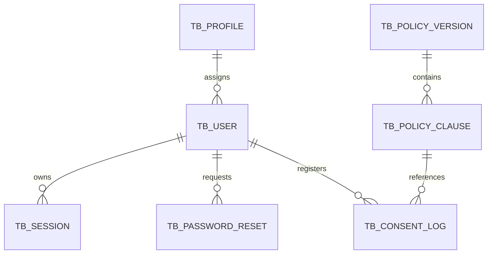

# Relational Database Documentation

## Overview

This database was designed to store sensitive user data in compliance with Brazil's General Data Protection Law (LGPD - Lei 13.709/2018). It uses PostgreSQL 15 with strict access controls, deterministic lookup hashes for email, append-only records for terms and consent evidence, and explicit anonymization support for data-subject erasure requests.

## Technology Stack

- **Database**: PostgreSQL 15
- **Versioning**: Flyway 9
- **Containerization**: Docker + Docker Compose

## Migration Execution Order

Flyway executes migrations in sequential order. The following order must be respected:

| File | Description |
|---|---|
| `V001__create_tables.sql` | Creates the baseline relational schema, including `TB_PASSWORD_RESET`, `ANONYMIZED_AT`, and the `V_PENDING_CONSENT` view |
| `V002__create_roles.sql` | Creates database roles, grants table-level permissions, and configures `dba_role` for unrestricted administration |
| `V003__create_triggers.sql` | Creates timestamp triggers and append-only protection triggers |
| `V004__security.sql` | Enables RLS, revokes public access, and documents deterministic `EMAIL_HASH` behavior |
| `V005__base_seed.sql` | Inserts minimum required data for all environments |
| `V006__synthetic_seed.sql` | Inserts fictional data for development only and can be disabled in production |
| `V007__rls_policies.sql` | Creates Row Level Security policies, ADMIN access policies, and operational indexes |

## Entity Relationship Diagram



## Table Descriptions

### `TB_PROFILE`
Stores user profiles for role-based access control (RBAC). Each user is assigned one profile that defines their permissions within the system.

| Column | Type | Rules |
|---|---|---|
| `PROFILE_UUID` | UUID | PK, auto-generated |
| `PROFILE_NAME` | VARCHAR(255) | NOT NULL, UNIQUE |
| `PERMISSIONS` | JSONB | NOT NULL |
| `DESCRIPTION` | TEXT | nullable |
| `CREATED_AT` | TIMESTAMPTZ | DEFAULT NOW() |
| `UPDATED_AT` | TIMESTAMPTZ | DEFAULT NOW(), updated by trigger |
| `DELETED_AT` | TIMESTAMPTZ | nullable, soft delete |

---

### `TB_USER`
Stores system users. Email is stored in two fields — one hashed with deterministic SHA-256 using a fixed salt from the `EMAIL_HASH_SALT` environment variable for lookup, and one encrypted for storage — following LGPD data minimization principles. The email field is immutable, so no hash update flow is required.

| Column | Type | Rules |
|---|---|---|
| `USER_UUID` | UUID | PK, auto-generated |
| `USERNAME` | VARCHAR(255) | NOT NULL, UNIQUE |
| `EMAIL_HASH` | VARCHAR(64) | NOT NULL, UNIQUE — deterministic SHA-256 hash with fixed salt from `EMAIL_HASH_SALT`, used for lookup without decrypting `EMAIL_ENC` |
| `EMAIL_ENC` | VARCHAR(255) | NOT NULL — encrypted value |
| `PASSWORD_HASH` | VARCHAR(255) | NOT NULL — Argon2id |
| `PROFILE_ID` | UUID | FK → TB_PROFILE |
| `ACTIVE` | BOOLEAN | NOT NULL, DEFAULT true |
| `CREATED_AT` | TIMESTAMPTZ | NOT NULL, DEFAULT NOW() |
| `UPDATED_AT` | TIMESTAMPTZ | NOT NULL, updated by trigger |
| `DELETED_AT` | TIMESTAMPTZ | nullable, soft delete |
| `ANONYMIZED_AT` | TIMESTAMPTZ | nullable — filled when personal data is anonymized |

---

### `TB_SESSION`
Tracks active user sessions individually. Allows forced logout, active device listing, and automatic expiration — rights the data subject can exercise under LGPD. A unique partial index on `USER_ID` where `INVALIDATED_AT IS NULL` ensures that each user has at most one active session at the database level.

| Column | Type | Rules |
|---|---|---|
| `SESSION_UUID` | UUID | PK, auto-generated |
| `USER_ID` | UUID | FK → TB_USER, NOT NULL |
| `SOURCE_IP` | VARCHAR(255) | NOT NULL, masked |
| `USER_AGENT` | VARCHAR(255) | NOT NULL |
| `EXPIRES_AT` | TIMESTAMPTZ | NOT NULL |
| `INVALIDATED_AT` | TIMESTAMPTZ | nullable |
| `CREATED_AT` | TIMESTAMPTZ | NOT NULL, DEFAULT NOW() |
| `UPDATED_AT` | TIMESTAMPTZ | NOT NULL, updated by trigger |
| `DELETED_AT` | TIMESTAMPTZ | nullable |

---

### `TB_AUTH_ATTEMPT`
Records every authentication attempt. It does not have a FK to `TB_USER` because the attempted email may not exist in the system. It supports brute-force detection by email hash and source IP.

| Column | Type | Rules |
|---|---|---|
| `ATTEMPT_UUID` | UUID | PK, auto-generated |
| `EMAIL_HASH` | VARCHAR(64) | NOT NULL — deterministic SHA-256 hash with fixed salt from `EMAIL_HASH_SALT`; not unique because multiple attempts may exist for the same email |
| `SOURCE_IP` | VARCHAR(255) | NOT NULL, masked |
| `SUCCESS` | BOOLEAN | NOT NULL |
| `BLOCKED` | BOOLEAN | NOT NULL, DEFAULT false |
| `ATTEMPTED_AT` | TIMESTAMPTZ | DEFAULT NOW() |

---

### `TB_PASSWORD_RESET`
Stores password reset requests using single-use tokens, with expiration control and traceability. The raw reset token is never stored in the database — only `TOKEN_HASH`, which contains the SHA-256 hash of the token.

| Column | Type | Rules |
|---|---|---|
| `RESET_UUID` | UUID | PK, auto-generated |
| `USER_UUID` | UUID | FK → TB_USER, NOT NULL |
| `TOKEN_HASH` | VARCHAR(64) | NOT NULL, UNIQUE — stores the SHA-256 hash of the reset token, never the token itself |
| `EXPIRES_AT` | TIMESTAMPTZ | NOT NULL |
| `USED_AT` | TIMESTAMPTZ | nullable — filled when the token is consumed |
| `CREATED_AT` | TIMESTAMPTZ | NOT NULL, DEFAULT NOW() |

---

### `TB_POLICY_VERSION`
Stores the complete immutable text of every version of privacy policies and terms of use. This table is append-only: updates and deletes are blocked by the database.

| Column | Type | Rules |
|---|---|---|
| `VERSION_UUID` | UUID | PK, auto-generated |
| `VERSION` | VARCHAR(20) | NOT NULL, UNIQUE |
| `POLICY_TYPE` | VARCHAR(255) | NOT NULL, CHECK IN ('PRIVACY_POLICY', 'TERMS_OF_USE') |
| `CONTENT` | TEXT | NOT NULL |
| `EFFECTIVE_FROM` | TIMESTAMPTZ | NOT NULL |
| `CREATED_AT` | TIMESTAMPTZ | NOT NULL, DEFAULT NOW() |
| `UPDATED_AT` | TIMESTAMPTZ | DEFAULT NOW(), updated by trigger |
| `DELETED_AT` | TIMESTAMPTZ | nullable |

---

### `TB_POLICY_CLAUSE`
Represents individual clauses that the user can accept or revoke independently. The `MANDATORY` field indicates clauses that cannot be revoked without closing the account. This table is append-only: updates and deletes are blocked by the database.

| Column | Type | Rules |
|---|---|---|
| `CLAUSE_UUID` | UUID | PK, auto-generated |
| `POLICY_VERSION_ID` | UUID | FK → TB_POLICY_VERSION, NOT NULL |
| `CODE` | VARCHAR(50) | NOT NULL, UNIQUE |
| `TITLE` | VARCHAR(255) | NOT NULL |
| `DESCRIPTION` | TEXT | nullable |
| `MANDATORY` | BOOLEAN | NOT NULL |
| `DISPLAY_ORDER` | INT | NOT NULL |
| `CREATED_AT` | TIMESTAMPTZ | DEFAULT NOW() |
| `UPDATED_AT` | TIMESTAMPTZ | DEFAULT NOW(), updated by trigger |
| `DELETED_AT` | TIMESTAMPTZ | nullable |

---

### `TB_CONSENT_LOG`
Records every consent event per clause per user. Both CONSENT and REVOCATION are inserted as new records — never updated. This table is append-only.

To determine the current state of a clause for a user, always query the most recent record:
```sql
SELECT DISTINCT ON (CLAUSE_ID)
    CLAUSE_ID,
    ACTION,
    CREATED_AT
FROM TB_CONSENT_LOG
WHERE USER_ID = $1
ORDER BY CLAUSE_ID, CREATED_AT DESC;
```

| Column | Type | Rules |
|---|---|---|
| `LOG_UUID` | UUID | PK, auto-generated |
| `USER_ID` | UUID | FK → TB_USER, NOT NULL |
| `CLAUSE_ID` | UUID | FK → TB_POLICY_CLAUSE, NOT NULL |
| `ACTION` | VARCHAR(255) | NOT NULL, CHECK IN ('CONSENT', 'REVOCATION') |
| `SOURCE_IP` | VARCHAR(255) | NOT NULL, masked |
| `CHANNEL` | VARCHAR(255) | NOT NULL — WEB, MOBILE, API |
| `CREATED_AT` | TIMESTAMPTZ | NOT NULL, DEFAULT NOW() |

---

## Views

### `V_PENDING_CONSENT`
Shows the clauses that are still pending consent for each active user, based on the latest record in `TB_CONSENT_LOG`.

| Column | Meaning |
|---|---|
| `USER_UUID` | user identifier |
| `USERNAME` | user login name |
| `CLAUSE_UUID` | clause identifier |
| `CLAUSE_CODE` | functional clause code |
| `CLAUSE_TITLE` | clause title |
| `MANDATORY` | whether the clause is required |
| `CONSENT_STATUS` | latest status or `PENDING` when no record exists |

---

## Security Controls

### Triggers
- `update_timestamp()` — automatically updates `UPDATED_AT` on every UPDATE
- `fn_protect_append_only()` — blocks UPDATE and DELETE on `TB_POLICY_VERSION`, `TB_POLICY_CLAUSE`, and `TB_CONSENT_LOG`

### Roles
| Role | Permissions |
|---|---|
| `app_role` | SELECT, INSERT, UPDATE on operational tables, including `TB_PASSWORD_RESET` |
| `log_role` | INSERT only on `TB_CONSENT_LOG` |
| `dba_role` | ALL PRIVILEGES with `BYPASSRLS` for administration and migrations |

### Row Level Security
RLS is enabled on `TB_USER`, `TB_SESSION`, and `TB_CONSENT_LOG`.

- Regular users can only access their own rows
- Users with the `ADMIN` profile can view and manage any user and session row
- The application must set the session variable before any query:

```sql
SET app.current_user_id = 'user-uuid-here';
```

### Performance Indexes
The schema uses these operational indexes:

- unique partial index on `TB_SESSION (USER_ID)` where `INVALIDATED_AT IS NULL`
- composite index on `TB_SESSION (USER_ID, EXPIRES_AT)`
- composite index on `TB_AUTH_ATTEMPT (EMAIL_HASH, ATTEMPTED_AT DESC)`
- composite index on `TB_AUTH_ATTEMPT (SOURCE_IP, ATTEMPTED_AT DESC)`

### Anonymization and Soft Delete
No physical DELETE is performed on user data. The recommended erasure flow is:

1. overwrite or clear personal fields at the application layer
2. populate `ANONYMIZED_AT`
3. populate `DELETED_AT`
4. set `ACTIVE = false`

This supports the LGPD right to erasure while preserving referential integrity for consent history and security records.
