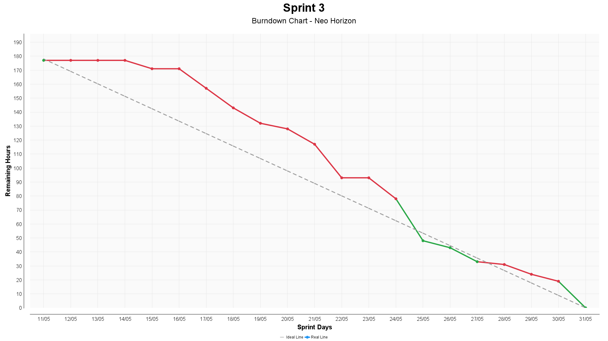

# Sprint 3

[Back to main README](../README.md#sprint-backlog)

> **Period:** May 11, 2026 to May 31, 2026  
> **Status:** Completed

---

## Sprint 3: Execution and Planning

- **Estimated Team Capacity:** `33`
- **Sprint Goal:** Deliver user stories `US11: Geographic Heatmap`, `US12: Authentication and Session Management`, `US13: Authorization and Route Protection`, `US14: Retention, Anonymization`, and `US15: Automatic Recalculation and Upload`, consolidating the geospatial, access-control, compliance and post-processing layer of the product.
- **Sprint Forecast (Stretch goals - non-committed items):** No stretch goals defined for this sprint.
- **Scope Adjustment:** `US10: Physical SAM Calculation` remains part of the product backlog roadmap for Sprint 3, but was anticipated and delivered during Sprint 2 as additional scope. Sprint 3 therefore starts from the delivered SAM base and focuses on the remaining backlog items.

| Id | Prioridade | Titulo | User Story | Estimativa | Sprint |
| -- | ---------- | ------ | ---------- | ---------- | ------ |
| US11 | Highest | [Geographic Heatmap](https://github.com/FatecNeoHorizon/API_6S/wiki/US11-%E2%80%94-Geographic-Heatmap) | As a commercial analyst, I want the system to provide a geospatial analytical base for future heatmap visualization, so that priority regions can be identified geographically using network indicators. | 13 | 3 |
| US12 | High | [Authentication and Session Management](https://github.com/FatecNeoHorizon/API_6S/wiki/US12-%E2%80%94-Authentication-and-Session-Management) | As a user, I want the system to authenticate my access and maintain a secure session, so that I can use the platform safely and only while properly authenticated. | 5 | 3 |
| US13 | Medium | [Authorization and Route Protection](https://github.com/FatecNeoHorizon/API_6S/wiki/US13-%E2%80%94-Authorization-and-Route-Protection) | As an administrator, I want the system to enforce access permissions by profile and protect routes and sensitive actions, so that each user can only access the features allowed for their role. | 5 | 3 |
| US14 | Medium | [Retention, Anonymization](https://github.com/FatecNeoHorizon/API_6S/wiki/US14-%E2%80%94-Retention,-Anonymization) | As an administrator, I want the system to support logical deletion, consent preservation and anonymization-ready lifecycle controls for sensitive data, so that the platform can handle personal information in a traceable and LGPD-oriented way. | 5 | 3 |
| US15 | Low | [Automatic Recalculation and Upload](https://github.com/FatecNeoHorizon/API_6S/wiki/US15-%E2%80%94-Automatic-Recalculation-and-Upload) | As a data analyst, I want the system to automatically load updated analytical data, so that the platform can keep its indicators and analyses based on the most recent available information. | 5 | 3 |

### Anticipated Item from Sprint 3

| Id | Titulo | Original Sprint | Actual Delivery | Notes |
| -- | ------ | --------------- | --------------- | ----- |
| US10 | [Physical SAM Calculation](https://github.com/FatecNeoHorizon/API_6S/wiki/US10-%E2%80%94-Physical-SAM-Calculation) | 3 | Sprint 2 | Delivered ahead of the original roadmap as additional scope, using the TAM calculation as the base for the serviceable market indicator. |

### Sprint Evolution (Burndown)

For the full guide on local usage, execution and CI, see: [Burndown Documentation](../burndown/README.md)

### Definition of Ready (DoR)
For a User Story to be ready to start in a sprint, the following criteria must be met:
- **Title, description and objective clear: story with defined scope**
- **Acceptance criteria and business rules: listed and approved**
- **Priority defined: aligned with roadmap/sprint**
- **Data and system access: credentials or alternative plan available**
- **Effort estimated: story points or hours estimated by the team**
- **Supporting artifacts: wireframes, mockups, diagrams or specifications attached**
- **Mandatory items defined: dependencies, pre‑conditions and constraints identified**
- **Linked to related RN / RNF requirements**

### Definition of Done (DoD)
For a User Story to be considered **complete**, the following criteria must be met:
- **Code implemented and locally tested:** Code is clean and follows team standards.
- **Technical documentation updated:** Usage instructions, architecture and design decisions are recorded.
- **Merged into `develop`:** Feature integrated into the `develop` branch without conflicts.
- **Code review approved:** Code review has been approved by at least one team member.
- **Automated tests created and passing:** Unit, integration and/or end‑to‑end tests exist and run successfully.
- **Acceptance criteria met:** All functional acceptance criteria have been validated.
- **Usability:** Interface follows usability principles and provides clear, consistent navigation.
- **LGPD compliance:** Data handling, masking, consent records and auditable logs are implemented.
- **Product Owner approval:** Functionality has been tested and approved by the Product Owner.
