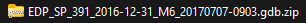
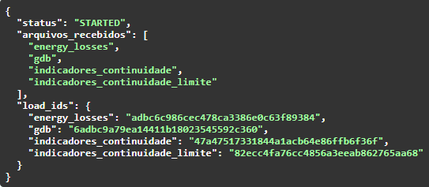
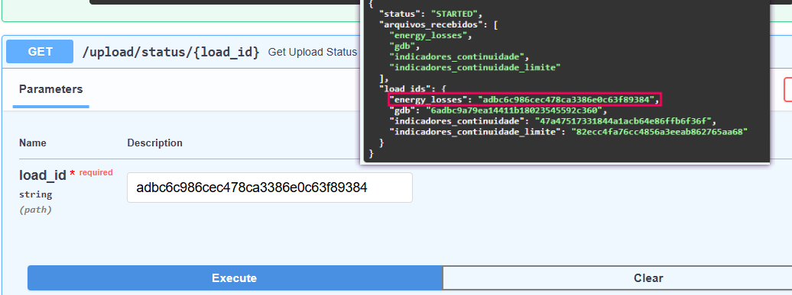
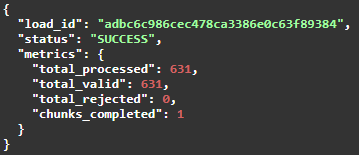

## HOW TO USE
1º - Start the application
Build and run the containers using Docker:
```bash
docker compose --profile full --profile tools up
```
### 2º - In your browser, go to: ```http://localhost:8000/docs```;
### 3º - In Swagger, find the /upload/ endpoint.
You must provide the following files:
- 1. Energy_losses - put this file: 
- 2. gdb - 
- 3. indicadores_continuidade - 
- 4. indicadores_continuidade_limite - 

And after execute

#### OBS: Look with calm the files extension
### 4º After execution, gonna show the files id.


So, will be necessary each id and put on /upload/status/{load_id} API. For example:
<br>

<br>
Will to return to you this message:
<br>
